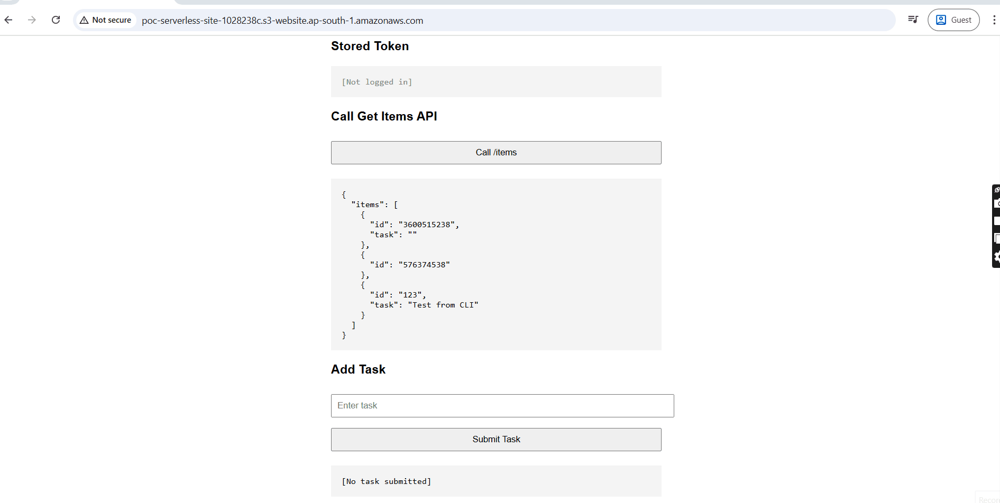
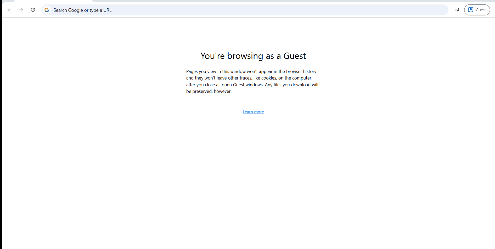
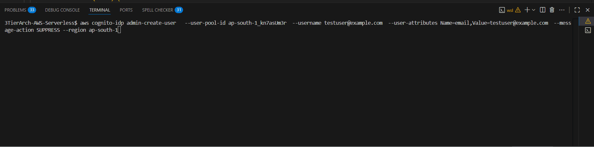

# Serverless 3-Tier Architecture on AWS (Demo Project)

This project demonstrates a **secure, cost-efficient, serverless 3-tier architecture** on AWS using **Terraform** and a simple frontend + backend stack.
It showcases how to build an application that mixes **public routes** (open access) and **protected routes** (Cognito JWT required).

---

## 🎥 Application flow - API calls open (no login) vs. API calls with Cognito JWT token.

| Scenario                                         | App Flow GIF                                            |
| ------------------------------------------------ | --------------------------------------------------      |
| App flow with Cognito authentication             |            |
| App flow without Cognito authentication          |             |
| Creating a Cognito user for authentication       |  |

✅ **Highlights in the demos:**

* GET `/items` → works without login (public)
* POST `/items` → blocked without token, works after Cognito login
* Cognito user created → JWT token issued → used to call protected route

---

## 🏗️ Architecture

The project implements a **classic 3-tier model** (Presentation, Business Logic, Data) with **AWS serverless services** for cost efficiency and zero operational overhead.

### **Presentation Layer**

* **Amazon S3** → Hosts static HTML/JS frontend
* **Amazon Cognito** → Provides authentication and JWT token issuance

### **Business Logic Layer**

* **Amazon API Gateway (HTTP API v2)** → API entry point
* **JWT Authorizer** → Protects sensitive routes (POST `/items`)
* **AWS Lambda (Python)** → Business logic handler

  * GET `/items` → fetch items (public)
  * POST `/items` → write item to DynamoDB (requires JWT)

### **Data Layer**

* **Amazon DynamoDB** → NoSQL database, pay-per-request billing

  * Stores items with `id`, `task`, `user`
  * Scales automatically, no ops overhead

---

## 🌐 Frontend

* **Static HTML + Vanilla JS** hosted on S3
* Demonstrates **two flows**:

  1. **Without authentication** → fetch data (`GET /items`)
  2. **With authentication** → login to Cognito → store JWT → use JWT for POST (`/items`)

✅ Evidence captured with GIFs for both scenarios

---

## ⚙️ Infrastructure as Code (Terraform)

* Infrastructure created via **modular Terraform setup**:

  * `presentation/` → S3, Cognito
  * `business/` → API Gateway, Lambda
  * `data/` → DynamoDB

* Example command flow:

  ```bash
  terraform init
  terraform plan -out=tfplan
  terraform apply "tfplan"
  ```

* Terraform ensures **repeatability** and **production-grade best practices**:

  * `source_code_hash` for Lambda updates
  * `cors_configuration` for API Gateway
  * `bucket policies` instead of ACLs

---

## 🧩 Challenges & Solutions

* **Lambda handler mismatch** → Initially packaged wrong (`index.handler` vs `index.lambda_handler`). Fixed by aligning handler config and automating zip packaging.
* **ACL conflicts** → S3 ACLs blocked by AWS defaults. Solved by using **bucket policies** (modern approach).
* **CloudFront blocked in free tier** → Smart fallback to S3 website hosting until account verification. Architecture is **future-ready** for CloudFront/OAI.
* **CORS errors** → Fixed by carefully setting API Gateway CORS to match the S3 website endpoint.
* **Public vs Protected routes** → Designed **dual route strategy**: public GET, protected POST → clear separation of concerns.

👉 Instead of just “fixing errors,” I applied **logical thinking**:

* Always checked **where the failure originated** (API Gateway vs Lambda).
* Applied **modern AWS best practices** (policies > ACLs, JWT authorizers > custom code).
* Ensured the design is **extensible** for future enhancements (CloudFront, CI/CD).

---

## 🌍 Why This Architecture Works (Real-World Value)

* **Cost efficiency** → Pay-per-request for Lambda & DynamoDB, free tier for S3/API Gateway
* **Scalability** → Scales to 1000s of requests without ops work
* **Security** → Cognito-managed user pool, JWT-based auth for protected routes
* **Zero maintenance** → No servers, no patching, minimal IAM footprint


## 🔮 Next Improvements

* Add **CloudFront OAI** for secure HTTPS hosting, this could not be accomplished due to free tier restrictions
* Filter `GET /items` by **user claim** (so users only see their own data)
* CI/CD pipeline for Lambda + Terraform (GitHub Actions)
* Add monitoring (CloudWatch metrics & X-Ray)
* Extend auth with Cognito Hosted UI instead of direct API login

---

## 🚦 Replication Steps

1. Clone repo & configure AWS CLI credentials
2. Deploy with Terraform:

   ```bash
   terraform init
   terraform apply
   ```
3. Upload `index.html` to S3 bucket:

   ```bash
   aws s3 cp index.html s3://<your-bucket-name>/
   ```
4. Open the S3 website URL → test **GET** without login
5. Create a Cognito user, log in, get JWT → test **POST** with token
6. Check DynamoDB for new items
7. Check CloudWatch for Lambda logs